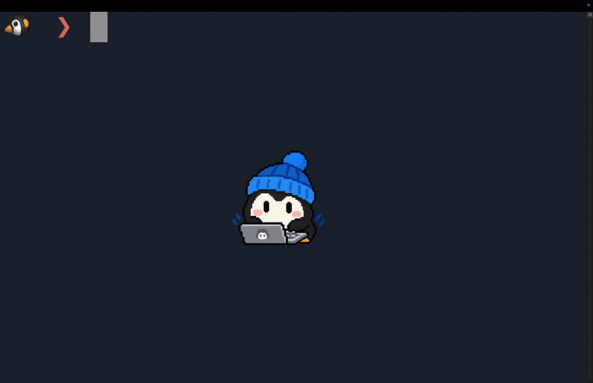
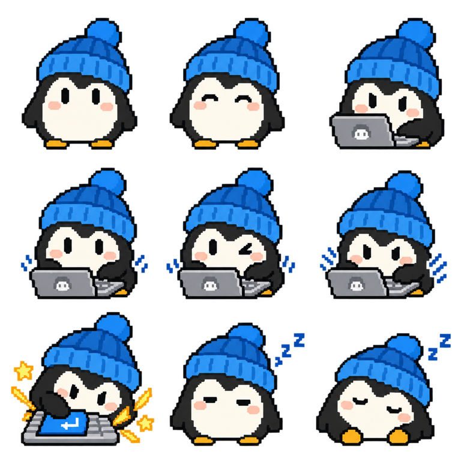

<div align="center">
  
  <h1>Waddly</h1>
</div>

<p align="center">A macOS app that lets your pet live on your desktop.</p>

<p align="center"><a href="README.md">日本語README</a></p>

<p align="center">
  
</p>

## Getting started

Waddly requires an Apple Silicon Mac running macOS 14 or later. The stable Homebrew Cask is available from the official tap.

```sh
brew tap nyatinte/waddly
brew install --cask waddly
```

Beta `0.1.0-beta.1` is available separately as `Waddly Beta.app`:

```sh
brew install --cask nyatinte/waddly/waddly-beta
```

Update the stable app with `brew upgrade --cask waddly` and the beta app with `brew upgrade --cask waddly-beta`. To try Waddly from source, follow the developer [build instructions](CONTRIBUTING.md).

The app is ad-hoc signed and is not notarized. If Gatekeeper warns on first launch, make sure the app came from the official GitHub Release, then Control-click it in Finder, choose Open, and confirm. If needed, allow it under System Settings → Privacy & Security → Open Anyway. Do not disable Gatekeeper or remove the quarantine attribute. For a manually downloaded DMG, verify it with the `.sha256` file attached to the same release.

On first launch, use the setup wizard to import a transparent PNG sprite sheet with a 3×3 grid. To make the pet react to keyboard input, allow Waddly under System Settings → Privacy & Security → Input Monitoring. The app launches without permission but does not respond to keys. See [Use your own pet](#use-your-own-pet) for image requirements.

If the setup wizard appears after upgrading from an earlier beta, import your sprite sheet again.

## Features

The pet reacts to key-down events. Waddly does not store typed text or key codes.

While idle, the pet breathes subtly and blinks. You can turn breathing on or off from the menu. The pet falls asleep after a while and stops animating after five minutes. Input Monitoring stays active so the pet can wake up.

You can drag the pet around the desktop, and Waddly saves its position. Choose Small, Medium, or Large for its display size.

The app displays Japanese or English based on your preferred macOS language. It uses English for other languages. In the Language menu, choose whether to follow System Settings or use Japanese or English. Restart Waddly to apply a change.

Waddly appears in both the Dock and menu bar. Use the Show in menu to change where it appears; at least one remains visible. Click the penguin icon in the menu bar or right-click the pet to open the menu. You can change the size and typing motion, configure images, pause reactions, and set the app to launch at login.

Pausing also cancels timed reactions. Changing images while paused does not start animations until you resume.

The menu bar shows only the supplied penguin artwork, at 24 pt.

The setup wizard opens on first launch. It guides you through the image-generation prompt, 3×3 PNG import, and Input Monitoring permission. You can drop a PNG anywhere on the image page. Import a custom image before continuing to the next page. You can reopen the wizard from the menu at any time.

Waddly is written in Swift and uses AppKit, Core Graphics, and Core Animation. It has no third-party libraries.

## Use your own pet

### Create images with ChatGPT

[Open ChatGPT](https://chatgpt.com/) and attach an image of the pet you want to use. Copy and paste the [Japanese prompt](prompts/ja.md) or [English prompt](prompts/en.md) to create a 3×3 sprite sheet. The prompts specify transparent padding around each pose so the character and keyboard do not crowd the cell boundaries.

### Image processing

During setup, import a transparent PNG sprite sheet with a 3×3 grid. The example below shows a reference image and the corresponding nine-cell sheet that Waddly splits during import.

| Reference image | 3×3 sprite sheet |
| --- | --- |
|  |  |

For display in this README, the reference image is reduced to 384 × 384 px and the sprite sheet to 768 × 768 px.

Waddly checks that the image is a transparent, square PNG with dimensions divisible by 3. Files must be at most 20 MB and 4096 px per side. Waddly splits the sheet into nine equal cells. Cells 1–2 are Idle, 3–6 are Typing, 7 is Enter, and 8–9 are Sleep. If a side exceeds 3072 px, Waddly reduces it to 3072 px before splitting.

Choose Pet images… from the menu to add multiple transparent PNGs to the Idle, Typing, Sleep, and Enter rows. Waddly reduces individual images to a maximum side length of 1024 px during import. Idle uses the first image as its normal pose and the rest as blink variants. Typing and Enter images play in order. Sleep images repeat in order and stop on the last image after five minutes.

Waddly stores each frame locally as a PNG in Application Support and restores it on the next launch. It does not modify the selected source file or upload images. Pet frames and sample artwork are not included in the app bundle. The app icon image is included separately.

Images made with an earlier prompt may use a different cell order. Use the current prompt order to assign the Enter, drowsy, and sleep reactions correctly.

### Example image license

The reference image was generated with inspiration from [Grokbot Icon Studio](https://grokbot-icon-studio.serio-ai.chatgpt.site/ja). That page states that the prompt text is licensed under [CC BY-NC 4.0](https://creativecommons.org/licenses/by-nc/4.0/) by APG, who uses `@multi_serio_ai` on X, for noncommercial use. Public redistribution of the prompt requires attribution, a source link, a license notice, and a change notice. Commercial use of the prompt requires separate permission. This repository does not include the prompt text.

The page also states that the prompt's CC BY-NC 4.0 license does not automatically apply to generated images. The operator does not claim copyright or revenue-sharing rights over those images and does not require attribution for them. Rights in generated images depend on applicable law, input-image rights, human creative contribution, and the AI service's terms. The repository author makes no claim over the 3×3 grid layout itself.

## Privacy

Waddly observes key-down events through a listen-only `CGEventTap`. It uses event timing and checks whether the key is Enter while handling the event. It does not store typed text or key codes, write input logs, or send input data over the network. The app can run without Input Monitoring permission.

Image decoding and persistence run sequentially in the background. Import previews are limited to 480 px. Image sets have a 40 MiB estimated memory budget, including each frame’s pixel buffer and 128 KiB of headroom. Additions exceeding the budget are rejected without saving, and failed loading does not delete existing files.

## Measured memory

The memory goal is a physical footprint below 100 MB in representative configurations. See the [repeatable profiling workflow, baselines, and regression tests](docs/MEMORY.md). Compare Release-app RSS and physical footprint across launch, typing, large images, repeated imports, and sleeping/frozen states. `mise run memory:test` runs the isolated regression suite (Swift 6.2 and macOS 26+; the production app still supports macOS 14).

## Adding localization keys

When adding or changing an app localization key, update both `macos/ja.lproj/Localizable.strings` and `macos/en.lproj/Localizable.strings`. Then run the following command from the repository root.

```sh
swift Tools/generate_localizations.swift
```

The generator checks that both languages have matching keys and regenerates the typed accessors. `./macos/build.sh` verifies that the generated file is current.

## License

The code is released under the [MIT License](LICENSE). The app icon, example images, and demo GIF are not covered by that license. The icon and GIF include the author's penguin artwork. Ask the author before reusing them.
