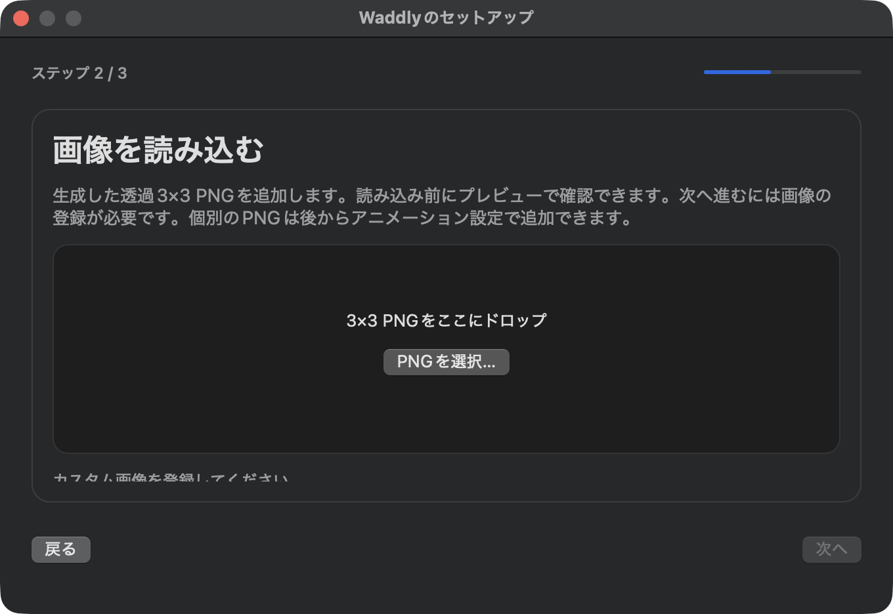
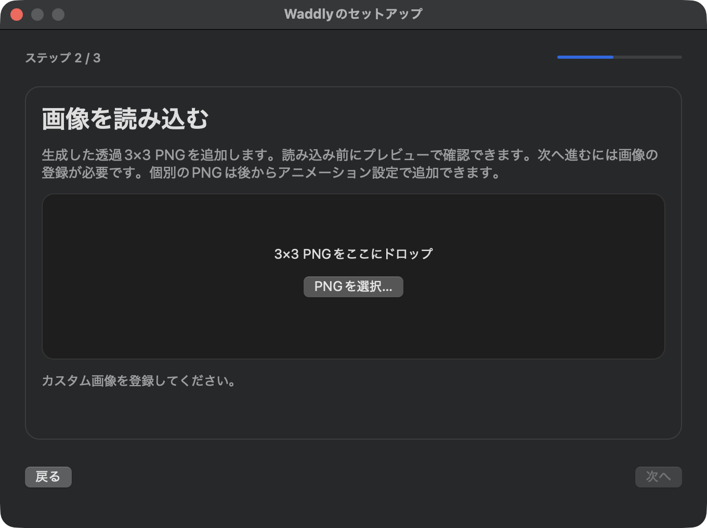

# 2026-10-05 リリース前検証

## 判定

リリース保留。機能上の不具合を 4 件修正し、38 テストと実アプリの主要操作を確認した。ただし、大画像の物理メモリが目標の 100 MB 未満を満たしていない。入力監視の新規許可・取り消し、ログイン起動、最低対応 OS での動作なども未検証のため、全面的なリリース承認にはしない。

`0.1.2` は既に公開済み。今回作成した同名のローカル DMG は公開済み配布物とは異なる。修正を公開する際は新しいバージョンとタグを用意し、その配布物を再検証する。バージョン変更、タグ作成、公開、Homebrew tap の更新は実施していない。

## 検証対象と環境

- ブランチは `release/e2e-final-gate`。ベースは `d810c9e`、対象は検証時点の作業ツリー（この PR の修正を含む）。
- Apple Silicon、macOS 27.0.1（26A434）、Apple Swift 6.4。
- Release 実行ファイルは arm64。ビルド情報の最低対応バージョンは macOS 14.0。
- 実アプリ検証では別のアプリ ID と画像保存先を使用。画像保存先は `build/e2e/` 以下に隔離した。環境変数によるホーム変更だけでは設定が隔離されず、設定は別のアプリ ID のドメインに保存された。
- 元の `dev.nyatinte.waddly` 設定と既存ペット画像は、検証前後の SHA-256 比較で変更がないことを確認した。
- 作例 PNG はドラッグ自動操作中に移動したため、Git のベースと内容が同一であることを確認して元の場所へ戻した。以後は使い捨てコピーを使用。

検証対象の Swift ソースとテストの指紋は次の値。`Sources/` と `Tests/` の Swift ファイルをパス順に並べ、各ファイルの相対パス・NUL・内容・NUL を SHA-256 に入力した。

```text
1a69516d960ec2b242e46ec35cc6e962afe3bb485b6b03abc952d3a36169d5b3
```

## 修正した不具合

| 問題 | 修正 | 回帰確認 |
| --- | --- | --- |
| セットアップの内側の画像カードがドロップを受け取り、画像登録処理が呼ばれない | 内側のカードのドラッグ登録を解除し、外側のページに処理を集約 | 登録済みドロップ領域のハンドラー確認、利用者による実ドラッグ確認 |
| 画像ページの状態メッセージが縦に切れる | ページとウィンドウの高さを拡大 | 日本語・英語のレイアウトテスト、実画面確認 |
| アニメーション設定のドロップ領域がスクロール操作を遮る | 子ビューを親に置き換える `hitTest` を削除 | スクロールビューへの入力経路テスト、10 枚登録時の横スクロール |
| Dock のみ表示し設定を閉じると、設定へ戻れない | 再オープン時にセットアップまたはアニメーション設定を表示 | 未登録・登録済み・セットアップ表示中のテストと実アプリ再オープン |

実際の翻訳文でレイアウトをテストするため、`LocalizationController` にリソースバンドルを注入可能にした。本体の既定値は引き続き `Bundle.main`。表示文言自体は変更していない。操作説明は日本語・英語の README に追記した。

画像ページの状態メッセージの修正前・修正後。

| 修正前 | 修正後 |
| --- | --- |
|  |  |

## 通過した検証

| 検証 | 結果と範囲 |
| --- | --- |
| `mise run check` | フォーマット、厳密な Lint、翻訳キー生成確認、38 テスト、Release ビルドが通過。Core 11 件、App 27 件。追加は 10 件で、引数付きテストのケース数とは区別する |
| `mise run package` | 最終ソースから DMG 作成が通過 |
| `mise run memory:test` | 割り当て上限の回帰テストは通過。既定では厳密な割り当て増加診断をスキップする |
| 画像登録 | PNG 選択、プレビュー、キャンセル、登録、9 コマのカテゴリ分割と端末内保存を確認。ドラッグは利用者が操作し、プレビュー表示を報告。後続の登録状態と保存ファイルを確認 |
| 個別画像編集 | 実アプリで 8 枚同時追加、並べ替え、横スクロール、削除、最後の 1 枚の削除禁止を確認。並べ替えでは既存ファイルの内容が変わらないことも確認 |
| 永続化と異常系 | 実アプリ再起動後の画像・言語・位置・表示先保持を確認。不正 PNG、置換キャンセル、保存画像欠損時のファイル・マニフェスト保持は統合テストで確認 |
| 言語 | 開いたセットアップと設定画面を日本語・英語へ切り替え、再起動なしで反映。両言語のコピー内容を同梱プロンプトと比較 |
| メニュー | サイズ 3 段階、揺れ 3 段階、呼吸の切り替え、一時停止・再開のメニュー表示、表示先の設定と選択状態を確認。メニューバーのみ表示時は最後の入口を隠せないことを確認 |
| キー入力 | 利用者の物理キーボード操作で文字と Enter の反応を確認。ペットだけの連続画像でもタイピングと待機・スリープの変化を確認。入力内容・キーコードの収集はしていない |
| アニメーション | 待機・タイピング・スリープ・静止、Enter、まばたき、一時停止、古い予約処理の無効化は既存の制御テストで確認。実時間 325 秒の無入力検証とは区別する |
| DMG | 読み取り専用マウント時のチェックサム検証と厳密な署名検証が通過。実行ファイルとリソースはビルド成果物と一致し、Applications のリンク先は `/Applications` |
| 実アプリとの一致 | アプリ ID 変更のための再署名部分を除去した比較で、GUI 検証に使った実行ファイルと最終ビルドの一致を確認 |
| プライバシーのコード確認 | 入力イベントのキーコードは Enter 判定でのみ使用。`Sources/` の検索では入力ログ・画像送信用処理は見つからず、外部 URL は ChatGPT を開く処理のみ。ただし網羅的な通信監査ではない |

ビルドには Command Line Tools 内の存在しない検索パスについてリンカー警告が出る。テスト・ビルド・署名検証は成功しているが、最低対応 OS での確認の代わりにはならない。

## メモリと配布の未解決事項

### 100 MB 目標の未達

`./macos/profile-image-app.sh` で、生成した透過 3072 × 3072 シートを 10 回置換し、設定画面を 30 秒表示、閉じてさらに 30 秒待機した。プレビューの準備と実際の保存処理を通すが、確認ボタン操作は省く測定用プロセスであり、通常の GUI 操作と区別する。

| 計測ファイル（`dist/memory/`） | ピーク物理メモリ | 最終物理メモリ |
| --- | ---: | ---: |
| `image-app-working-tree-20261005T125511Z.csv` | 133.94 MB | 104.07 MB |
| `image-app-working-tree-20261005T131447Z.csv` | 131.06 MB | 101.16 MB |
| `image-app-working-tree-20261005T135250Z.csv` | 135.23 MB | 104.92 MB |

MB は 1,000,000 バイト。各計測時点には UI 修正の差分があるため、同一コミットの 3 回反復や改善率の根拠にはしない。すべての回で既定の目標を超えた。最終回は今回の本体修正を含む。プローブ起動時には sandbox extension の警告も出たが、CSV は終了まで出力された。

通常の小さな作例画像では `leaks` の補助出力で約 35 MiB の物理メモリを観測した。これは大画像の上限超過を相殺しない。大画像の保持・置換時のピークを減らすか、サポートする画像条件と目標の変更を承認したうえで再計測する必要がある。

### 割り当て診断の失敗

`WADDLY_EVALUATE_LEAKS=1 mise run memory:test` は、16 ブロック・約 3.23 KB の純増で失敗した。通常の上限テストは通過した。既存の[メモリ資料](MEMORY.md)にも小さな割り当て増加の診断失敗が記載されている。

実プロセスの `leaks` も非ゼロを報告したが、セキュリティ制約で読み取り対象が制限されている。フレームワークの循環参照も出力に含まれる。これらだけではアプリ固有の所有権リークとは断定できず、割り当てスタックの分類が残る。

### Gatekeeper と配布手順

`codesign --verify --deep --strict` は通過した一方、`spctl --assess --type execute` は拒否（終了コード 3）。既定の ad-hoc 署名・公証なしの仕様と一致する。

公開済みの Homebrew Cask は隔離属性を削除する処理を持つことを読み取り確認した。ただし、本検証では Homebrew からの新規インストール・更新を実行していない。直接ダウンロード時の手動許可も実機で検証していない。無警告の初回起動をリリース条件にする場合は Developer ID 署名・公証が必要。

## 未検証の実機シナリオ

- 入力監視の新規許可、拒否、取り消し、再許可。実アプリでは OS の許可照会が初めから許可済みだった。未許可でも完了できる画面遷移は依存を置き換えたテストのみ。
- ログイン項目登録・解除と再ログイン後の自動起動。利用者のログイン設定は変更していない。
- macOS 14、および他の対応 OS での実行。バイナリの最低対応バージョン確認だけで対応済みとは判断しない。
- 複数画面、画面取り外し、Spaces、フルスクリーン、画面スケール変更。
- ペットの実ドラッグ後の位置保存。保存済み位置の再起動保持は確認したが、新しい位置への移動操作は別項目。
- 無入力を 325 秒以上維持した実時間の静止・再起床、長時間連続稼働、スリープ・復帰。
- 修正を含む新バージョンでの Homebrew 新規インストール・更新と、隔離属性付き DMG からの初回起動。

## ローカル証跡と再確認

操作ツリー、測定、配布物の証跡は `build/e2e/evidence/` と `dist/memory/` にある。画像はツールの一時保存先から `build/e2e/evidence/screenshots/` にコピーした。これらは Git 管理外のローカル成果物で、チェックアウトだけでは再取得できない。

今回のローカル DMG の SHA-256 は次の値。公開済み `0.1.2` のチェックサムとは異なる。

```text
5fdcd14d742df42d2f27e9a3b61a6891322f2373a89a81d959e6ba7fb5ed847f
```

再検証では `mise run check`、`mise run package`、`mise run memory:test` を実行し、上記のメモリ測定と未検証の実機シナリオを確認する。問題を修正するか、要件の例外を明示的に承認するまでリリース保留とする。
